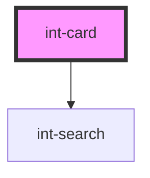

# int-card

<!-- Auto Generated Below -->

## Properties

| Property   | Attribute   | Description | Type     | Default     |
| ---------- | ----------- | ----------- | -------- | ----------- |
| `userName` | `user-name` |             | `string` | `undefined` |

## Dependencies

### Depends on

- [int-search](../int-search)

### Graph

----------------------------------------------

*Built with [StencilJS](https://stenciljs.com/)*
